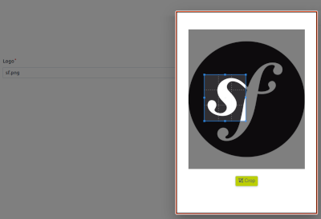

# EasyCrop Bundle



The EasyCrop Bundle is a specialized Symfony bundle designed to seamlessly enhance the image handling capabilities of [EasyAdmin](https://github.com/EasyCorp/EasyAdminBundle). This bundle offers a straightforward way to integrate image uploading and cropping functionalities into your application. At its core, the EasyCrop Bundle introduces a custom field type named `CropField`, meticulously crafted to bring cropping functionalities to your EasyAdmin-powered application. This field type, built upon the foundation of `EasyCorp\Bundle\EasyAdminBundle\Field\ImageField`, adds the convenience of image cropping while maintaining compatibility with the core classes of [EasyAdmin](https://github.com/EasyCorp/EasyAdminBundle)

## Installation

You can install the EasyCrop Bundle using Composer:

```bash
composer require insitaction/easycrop
```

## Features

The primary feature of this bundle is the `CropField`, which enables users to upload images and crop them to their desired dimensions. The core functionality is achieved through the `CropType` form type, a variation of the `EasyCorp\Bundle\EasyAdminBundle\Form\Type\FileUploadType`. The key distinction is that `CropType` incorporates additional logic through a Stimulus controller.

>:warning: The multiple option is currently not supported by `CropField`.

## Usage

Don't forget to add the theme file for the formatting to be effective

1. Add the CropField to your EasyAdmin configuration:

```php

use Insitaction\EasyCropBundle\Field\CropField;

// ...

yield CropField::new('image', 'Image')
    ->setBasePath('/uploads/images/')
    ->setUploadDir('public/uploads/images/')
;
```

The `CropField` integrates seamlessly into your existing EasyAdmin configuration, allowing users to upload images and crop them directly within the form.
Behind the scenes, the `CropType` form type utilizes a Stimulus controller that interacts with react-cropper to facilitate image cropping. Once the user selects the desired crop area, the controller converts the cropped image into a Base64 string representation.

## Contributing

If you encounter any issues or would like to contribute to the EasyCrop Bundle, feel free to create a pull request or submit an issue on the GitHub repository.

## License

The EasyCrop Bundle is open-source software licensed under the MIT license.
